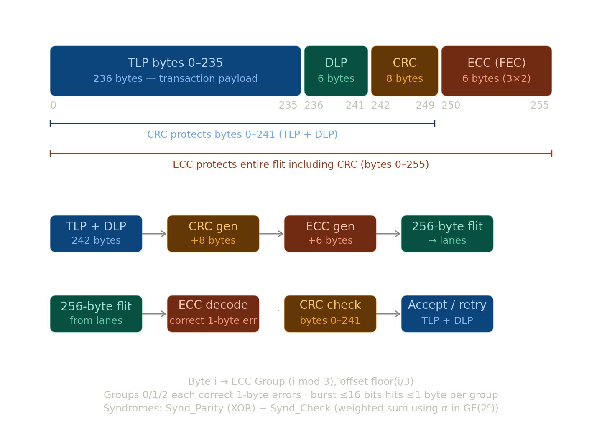

# PCIe 6.4 Specification Section 4.2.3 FLIT mode operation

>[!IMPORTANT]
> **This ECC ONLY DO ONE BYTE CORRECTION. IF THERE ARE BIT ERRORS IN MULTIPLE BYTES IT MAY NOT WORK. REFER 4.2.3.4.5 SECTION FOR MORE INFO**
> I mean any bit errors in a single byte can be corrected.

>[!NOTE]
> I tested more on this and came to realise ECC can correct one byte each from ECC groups, since we are doing 3-way interleaved ECC so at most 3 bytes can be corrected.
> **If there are two or more bytes are corrupted from any one group, then it fails to correct. That means 3 consecutive corrupted bytes can be corrected.**

**Flit Mode — the big picture**

A "flit" (flow control unit) is PCIe's fixed-size transmission container introduced in Gen 6 and also applied to lower data rates for consistency. Every flit is exactly **256 bytes**, structured as:

- **236 bytes** — TLP payload (the actual transaction data)
- **6 bytes** — DLP / Data Link Layer Payload (link-layer control, like flow credit updates)
- **8 bytes** — CRC (protects the TLP + DLP bytes)
- **6 bytes** — ECC (Forward Error Correction, protects the entire flit including CRC)

The key difference from non-Flit Mode: TLPs and DLLPs no longer use packet delimiters (STP, SDP, END, EDB tokens or Framing Tokens). Instead, their positions are **fixed** within every flit. The receiver always knows exactly where each field is. This simplifies parsing and makes better use of bandwidth, especially at 64 GT/s with PAM4 signaling where burst errors are more likely.

The flit bytes are interleaved across all active lanes in byte-aligned fashion — so on a x16 link, each symbol time sends 16 bytes (one per lane), and a full flit takes 16 symbol-times.

---

**Section 4.2.3.4.4 — CRC Bytes in Flit**

The 8 CRC bytes (bytes 242–249) protect the first 242 bytes of the flit (the TLP + DLP content). They do **not** protect the ECC bytes.

The CRC uses a generator polynomial defined over GF(2⁸): essentially an 8-byte checksum computed from all 242 data bytes using a generator matrix (1936×64 bits — treating 242 bytes as 1936 bits). The spec provides the exact generator matrix in Appendix K, which is the normative reference for implementation.

On the **transmit side**, the 8 CRC bytes are computed from bytes 0–241 and appended. On the **receive side**, after the ECC decode/correction step, the receiver independently recomputes the CRC from the received bytes 0–241 and compares it to the received bytes 242–249. Any mismatch means the flit is declared invalid and a **replay is requested** (via the Flit Sequence Number and Retry mechanism in §4.2.3.4.2.1). Pipelining is explicitly allowed, but any implementation must produce results identical to the reference matrix multiplication.

---

**Section 4.2.3.4.5 — ECC Bytes in Flit**

The 6 ECC bytes (bytes 250–255) implement a **3-way interleaved Forward Error Correction (FEC)** code. Here's how it works:

**Why 3-way interleaving?** PAM4 at 64 GT/s is susceptible to burst errors within a lane — a noise hit might corrupt up to 16 consecutive bits on a single lane. The 3-way interleaving is designed so that any burst ≤ 16 bits on a single wire hits **at most one byte in each ECC code word**, keeping each group correctable.

**The three ECC groups** are assigned by taking flit byte index `i` and computing `i mod 3` for the group and `floor(i/3)` for the position within that group (for bytes 0–249). Each group is essentially an (85 or 86)-byte Reed-Solomon-like code over GF(2⁸), with two parity bytes per group:

- **Horizontal parity byte** (B_N-1): XOR of all data bytes in the group
- **Check byte** (B_N-2): a weighted sum using powers of α (where α is a root of the primitive polynomial x⁸ + x⁴ + x³ + x² + 1)

The 6 ECC bytes are mapped as ECC0[0], ECC0[1] (group 0), ECC1[0], ECC1[1] (group 1), ECC2[0], ECC2[1] (group 2) — placed at flit bytes 250–255.

**Decoding** on the receive side computes two syndrome values per group:
- `Synd_Parity` — XOR of received data bytes
- `Synd_Check` — expected vs. received check byte

The four outcomes are:

| Synd_Check | Synd_Parity | Result                                                                                        |
| ---------- | ----------- | --------------------------------------------------------------------------------------------- |
| = 00h      | = 00h       | No error                                                                                      |
| = 00h      | ≠ 00h       | Error in the parity byte itself → corrected directly                                          |
| ≠ 00h      | = 00h       | Error in the check byte itself → corrected directly                                           |
| ≠ 00h      | ≠ 00h       | Single symbol (byte) error → use log tables to find which byte failed, then XOR to correct it |

If the syndrome points to a non-existent byte position, it's an **uncorrectable error**. After all three ECC decoders run in parallel, the corrected 250 bytes are then passed to the CRC check. If CRC also passes, the flit is accepted; if it fails, a flit retry is triggered.

---

Here's a diagram showing how all the pieces fit together in a single flit: 

The key design insight tying all three together: **ECC corrects first, then CRC validates**. ECC handles the inevitable bit errors from PAM4 signaling (which has tighter voltage margins than NRZ), while CRC catches any remaining uncorrectable errors and triggers a link-layer replay. The two layers complement each other — ECC is fast hardware correction in-flight, CRC is the final safety net.

## Run

1. `make` to get executable
2. `make run` to run extensively check for all idx and with all possible xor value for each byte idx position in the payload.
3. `make rand` for random payload **242 byte** size.
